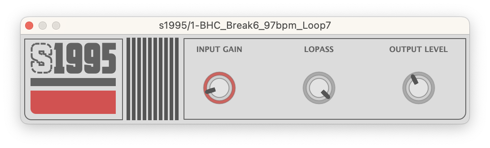

# S1995 - 90s-Style ADC/DAC Sampler Emulator

A  VST3 plugin that emulates the characteristics of old-school ADC/DAC sampler converters, loosely inspired by the S950. Designed and built through a combination of techniques:

## Implementation Details

### Asymmetrical Saturation
Asymmetrical Saturation is implemented to emulate the inaccuracies and non-linearities found in vintage analog-to-digital converters. Adding subtle harmonic distortion, enhancing the character of the processed audio by introducing odd and even harmonics differently depending on the signal polarity.

### Bit Depth Reduction
The signal undergoes anti-aliasing and bit depth reduction, introducing quantization artifacts that mimic the resolution limits of classic samplers.

### ~~Sample Rate Decimation~~
~~The divide-rate technique is used for sample rate reduction.~~
Removed as was introducing unwanted high frequencies, noticed through A/B testing with other emulators.

### Classic Low Pass filter
A **6th order Butterworth** filter is applied to emulate the classic s950 filter sound.

#### Planned Features

Variable Sample Rate Reduction: A parameter to adjust the degree of decimation dynamically, offering more control over the lo-fi effect. Semitone-quantized pitch shifting.

## TO BUILD
The project is open source, all you need to compile it is cmake and juce, note that the JUCE subdirectory path is hardcoded in the cmakelists file, you'll have to provide a path to your own juce repo.
